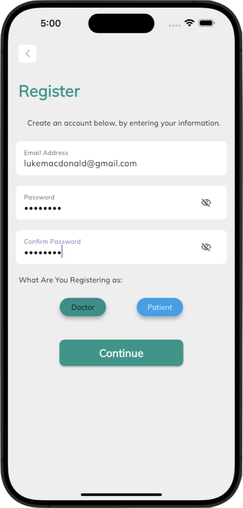
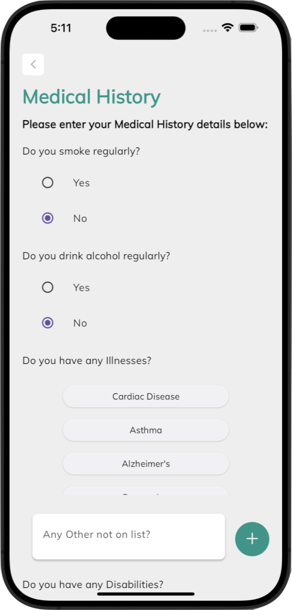
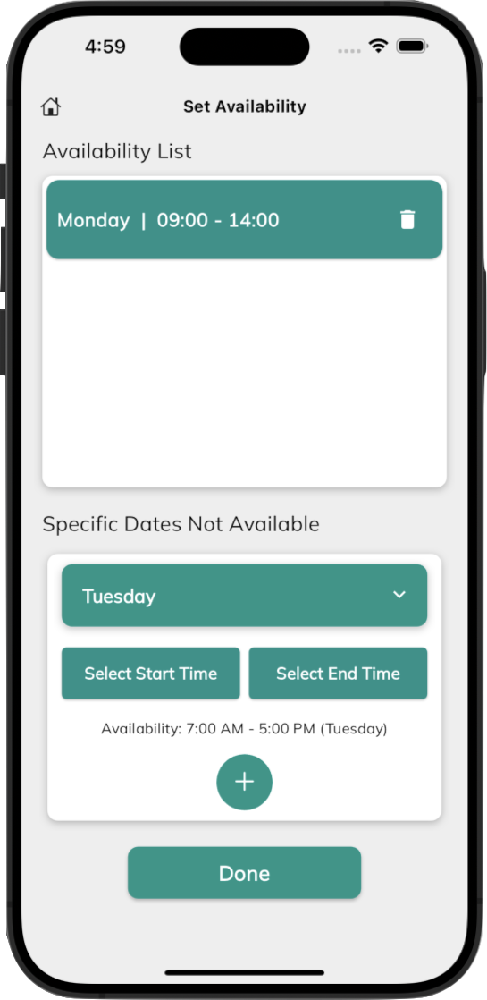
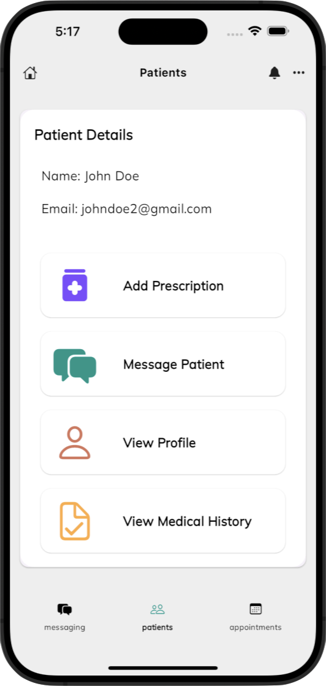

<!-- Improved compatibility of back to top link: See: https://github.com/othneildrew/Best-README-Template/pull/73 -->

<a name="readme-top"></a>

<!--
*** Thanks for checking out the Best-README-Template. If you have a suggestion
*** that would make this better, please fork the repo and create a pull request
*** or simply open an issue with the tag "enhancement".
*** Don't forget to give the project a star!
*** Thanks again! Now go create something AMAZING! :D
-->

<!-- PROJECT SHIELDS -->
<!--
*** I'm using markdown "reference style" links for readability.
*** Reference links are enclosed in brackets [ ] instead of parentheses ( ).
*** See the bottom of this document for the declaration of the reference variables
*** for contributors-url, forks-url, etc. This is an optional, concise syntax you may use.
*** https://www.markdownguide.org/basic-syntax/#reference-style-links
-->

[![Contributors][contributors-shield]][contributors-url]
[![Forks][forks-shield]][forks-url]
[![Stargazers][stars-shield]][stars-url]
[![Issues][issues-shield]][issues-url][![LinkedIn][linkedin-shield]][linkedin-url] <!-- PROJECT LOGO --> <br /> <div align="center"> <a href="https://github.com/LukeMacdonald/mediconnect">  </a> <h3 align="center">MediConnect</h3>
An all service Telemedicine Mobile App using Flutter, Springboot and Docker. It enables booking of doctor appointments, prescription management and real-time communication between doctors and patients.<p align="center"> <br />
<a href="https://github.com/LukeMacdonald/mediconnect"><strong>Explore the docs »</strong></a>
<br />
<br />
<a href="https://github.com/LukeMacdonald/mediconnect">View Demo</a>
·
<a href="https://github.com/LukeMacdonald/mediconnect/issues">Report Bug</a>
·
<a href="https://github.com/LukeMacdonald/mediconnect/issues">Request Feature</a>

  </p>
</div>

<!-- TABLE OF CONTENTS -->
<details>
  <summary>Table of Contents</summary>
  <ol>
    <li>
      <a href="#about-the-project">About The Project</a>
      <ul>
        <li><a href="#built-with">Built With</a></li>
      </ul>
    </li>
    <li>
      <a href="#getting-started">Getting Started</a>
      <ul>
        <li><a href="#prerequisites">Prerequisites</a></li>
        <li><a href="#installation">Installation</a></li>
      </ul>
    </li>
    <li><a href="#usage">Usage</a></li>
    <li><a href="#roadmap">Roadmap</a></li>
    <li><a href="#contributing">Contributing</a></li>
    <li><a href="#contact">Contact</a></li>
  </ol>
</details>

<!-- ABOUT THE PROJECT -->

## About The Project

[![Product Name Screen Shot][product-screenshot]](https://example.com)

MediConnect is a user-friendly healthcare solution built with a Flutter frontend and a Spring Boot backend. The application seamlessly combines advanced technology with medical services, providing users with convenient access to healthcare resources.<p align="right">(<a href="#readme-top">back to top</a>)</p>

### Built With

- [![Flutter][Flutter.com]][Flutter-url]
- [![Springboot][Springboot.com]][Springboot-url]
- [![Postgres][Postgres.com]][Postgres-url]
- [![Docker][Docker.com]][Docker-url]
- [![Kubernetes][Kubernetes.com]][Kubernetes-url]
- [![RabbitMQ][RabbitMQ-badge]][RabbitMQ-url]
<p align="right">(<a href="#readme-top">back to top</a>)</p>

<!-- GETTING STARTED -->

## Getting Started

### Prerequisites

This is an example of how to list things you need to use the software and how to install them.

1. [Install Flutter](https://docs.flutter.dev/get-started/install)
2. [Install Docker](https://docs.docker.com/engine/install/)

### Installation

1. Clone the repo

   ```sh
   git clone https://github.com/LukeMacdonald/mediconnect.git
   ```

2. Run Microservice Backend

   ```sh
   docker compose up -d
   ```

3. Configure postgress database (Only required on initial startup)
   - Visit [pgAdmin Dashboard](http://localhost:5050)
   - Create new server
   - Set server host to internal IP address of postgres container
   - Set username and password to values specified in docker-compose.yaml for postgres container
   - Create new database called mediconnect
4. (Optional) Restart microservices

   ```sh
   docker compose down
   docker compose up -d
   ```

5. Load Mobile Simulator (iOS or Android)
6. Run Frontend on Simulator

   ```sh
   cd client
   flutter run
   ```

<p align="right">(<a href="#readme-top">back to top</a>)</p>

<!-- USAGE EXAMPLES -->

## Usage

#### Account Creation

MediConnect allows users to provide as much detail about their medical history as possible to allow doctors to have a fully understanding of their patients and to streamline appointments.

<div class="row">
    
    

</div>

#### Managing Appointments

MediConnect allows users to easily schedule appointments with their selected doctor through a straightforward and intuitive booking system.

<div class="row">


</div>

#### Realtime Chat Between Doctors and Patients

The platform facilitates real-time communication between users and healthcare providers through a secure messaging system.

<div class="row">
    
    
</div>

#### Doctors Have Full Control Over Their Own Schedule

Doctors are able to specify their own availaibilites themselves and manage their own patients which just a few taps of their fingers at any time.

<div class="row">


</div>
<p align="right">(<a href="#readme-top">back to top</a>)</p>

<!-- ROADMAP -->

## Roadmap

- [x] Profile Creation
  - [x] Recording Patients Medical History
  - [x] Code Authentication for Doctor Accounts
- [x] Doctor Setting Availability
- [x] Patients Booking Appointment
  - [x] Booking Validation
  - [x] Cancel or Update Appointment
- [x] Prescription Management
- [x] Faciliate Chat between Doctor and Patient in Realtime
  - [ ] Update chat service to use firebase instead.
- [ ] Push Notifications for Appointments

See the [open issues](https://github.com/LukeMacdonald/mediconnect/issues) for a full list of proposed features (and known issues).

<p align="right">(<a href="#readme-top">back to top</a>)</p>

<!-- CONTRIBUTING -->

## Contributing

Contributions are what make the open source community such an amazing place to learn, inspire, and create. Any contributions you make are **greatly appreciated**.

If you have a suggestion that would make this better, please fork the repo and create a pull request. You can also simply open an issue with the tag "enhancement".
Don't forget to give the project a star! Thanks again!

1. Fork the Project
2. Create your Feature Branch (`git checkout -b feature/AmazingFeature`)
3. Commit your Changes (`git commit -m 'Add some AmazingFeature'`)
4. Push to the Branch (`git push origin feature/AmazingFeature`)
5. Open a Pull Request

<p align="right">(<a href="#readme-top">back to top</a>)</p>

<!-- CONTACT -->

## Contact

Luke Macdonald - lukemacdonald21@gmail.com.com

Project Link: [https://github.com/LukeMacdonald/mediconnect](https://github.com/LukeMacdonald/mediconnect)

<p align="right">(<a href="#readme-top">back to top</a>)</p>

<!-- MARKDOWN LINKS & IMAGES -->
<!-- https://www.markdownguide.org/basic-syntax/#reference-style-links -->

[contributors-shield]: https://img.shields.io/github/contributors/LukeMacdonald/mediconnect.svg?style=for-the-badge
[contributors-url]: https://github.com/LukeMacdonald/mediconnect/graphs/contributors
[forks-shield]: https://img.shields.io/github/forks/LukeMacdonald/mediconnect.svg?style=for-the-badge
[forks-url]: https://github.com/LukeMacdonald/mediconnect/network/members
[stars-shield]: https://img.shields.io/github/stars/LukeMacdonald/mediconnect.svg?style=for-the-badge
[stars-url]: https://github.com/LukeMacdonald/mediconnect/stargazers
[issues-shield]: https://img.shields.io/github/issues/LukeMacdonald/mediconnect.svg?style=for-the-badge
[issues-url]: https://github.com/LukeMacdonald/mediconnect/issues
[license-shield]: https://img.shields.io/github/license/LukeMacdonald/mediconnect.svg?style=for-the-badge
[license-url]: https://github.com/LukeMacdonald/mediconnect/blob/master/LICENSE.txt
[linkedin-shield]: https://img.shields.io/badge/-LinkedIn-black.svg?style=for-the-badge&logo=linkedin&colorB=555
[linkedin-url]: https://linkedin.com/in/luke-macdonald-292a4a208
[product-screenshot]: images/screenshot.png
[Flutter.com]: https://img.shields.io/badge/Flutter-%2302569B.svg?style=for-the-badge&logo=Flutter&logoColor=white
[Flutter-url]: https://flutter.dev
[Springboot.com]: https://img.shields.io/badge/spring-%236DB33F.svg?style=for-the-badge&logo=spring&logoColor=white
[Springboot-url]: https://spring.io/
[Postgres.com]: https://img.shields.io/badge/postgres-%23316192.svg?style=for-the-badge&logo=postgresql&logoColor=white
[Postgres-url]: https://www.postgresql.org/
[Docker.com]: https://img.shields.io/badge/docker-%230db7ed.svg?style=for-the-badge&logo=docker&logoColor=white
[Docker-url]: https://www.docker.com/
[Kubernetes.com]: https://img.shields.io/badge/kubernetes-%23326ce5.svg?style=for-the-badge&logo=kubernetes&logoColor=white
[Kubernetes-url]: https://kubernetes.io/
[RabbitMQ-badge]: https://img.shields.io/badge/Rabbitmq-FF6600?style=for-the-badge&logo=rabbitmq&logoColor=white
[RabbitMQ-url]: https://www.rabbitmq.com/
